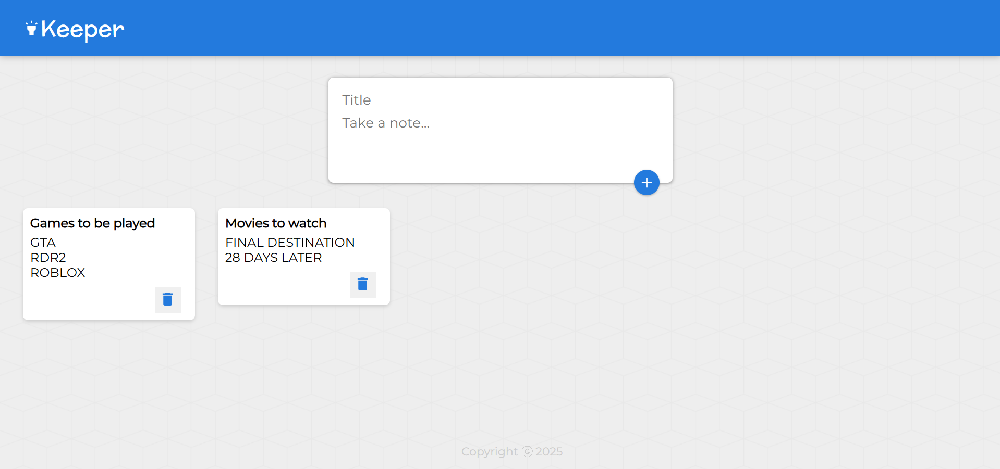

# 📝 KeeperApp

KeeperApp is a simple note-taking web application built with **React** and **Vite**.  
It allows users to create, view, and delete notes with a clean and minimal UI.

---

## 🚀 Features
- Add and delete notes
- Minimal, clean UI
- Fast build with Vite
- Lightweight and responsive

---

## 🛠️ Installation & Setup

1. Clone the repository:
   git clone https://github.com/phantomxcode/KeeperApp.git
   cd KeeperApp

2. Install dependencies:
   npm install

3. Run the development server:
   npm run dev

---

## 📸 Preview

---
